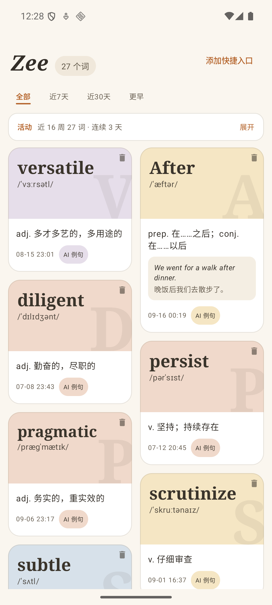
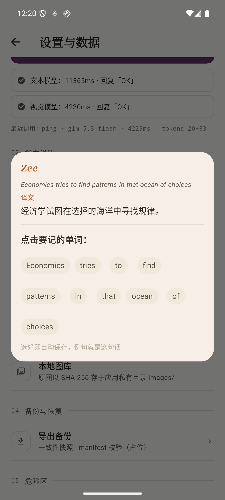
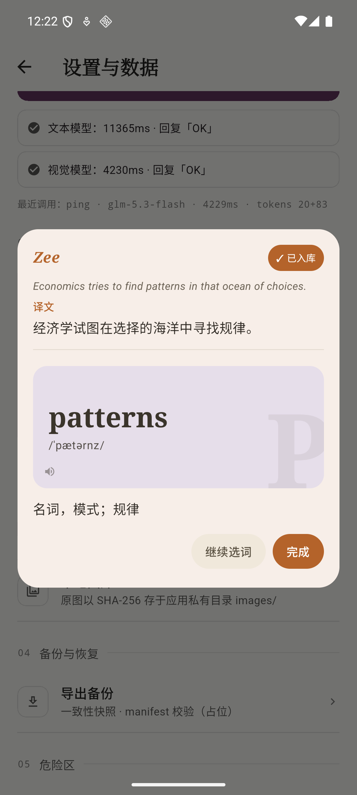
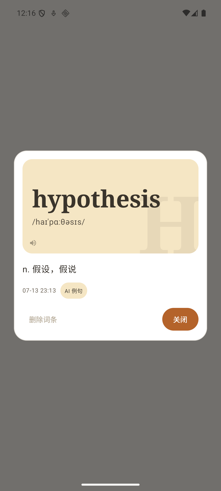
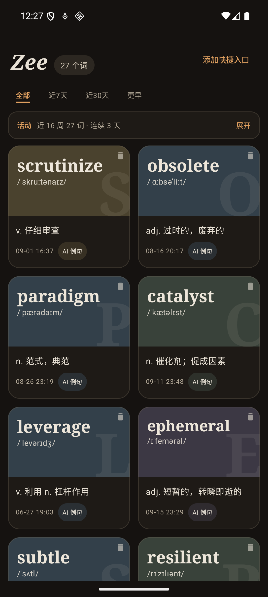

# Lexiary

**Lexicon + Vocabulary + Diary** —— 一本随读随记的词汇手账。

应用名 **Zee**。在 X、RSS、浏览器或任何应用里读到英文，选中或复制，Zee 在当前页面上方弹出：整句翻译置顶，点哪个词记哪个词，原句自动存为例句——不打断阅读，逐词积累，用一张热力图看着自己的词汇海洋慢慢长出来。

<p align="center">
  
  
  
  
  
</p>

## 功能

- **三种入口，随读随记**
  - 系统文本选择菜单：任何应用里长按选中英文 → 点「Zee」；
  - 快捷磁贴：复制英文 → 下拉控制中心 → 点「Zee 查词」（国产 ROM 选词菜单受限时的可靠通道）；
  - 整句模式：选中整句则置顶显示 AI 译文（读完即走，不入库），句子拆成词胶囊，点哪个记哪个，原句自动成为该词的例句。
- **生词本主页**
  - **闪卡词版**：卡片只显示英文——词版封面（衬线大字 + 音标 + 幽灵首字母水印）与英文原句引文，中文释义点开详情才揭晓，每一次下滑都是一次主动回忆测试；封面高度随词长错落，暖色按词哈希轮换；
  - **打开乱序**：每次冷启动重新洗牌、会话内保持稳定，打破位置记忆、帮助真实记词；
  - **时间筛选**：全部 / 近 7 天 / 近 30 天 / 更早；
  - **活动热力图**：近 16 周的收录格 + 连续天数，GitHub 式的坚持可视化；
  - **点击发音**：点词条详情封面即听读音（系统 TTS，离线、零依赖；设备无可用引擎时入口自动隐藏）。
- **极简依赖**：网络层为 `HttpURLConnection` + `org.json`，存储为原生 `SQLiteOpenHelper`，无 Retrofit/Room/OkHttp，无图片库；深浅色主题跟随系统。

## 配置 API Key

> **本项目不含任何 API Key。** 词典与翻译由 [DeepSeek](https://platform.deepseek.com/) 提供，你需要自己的 Key（注册即送额度）。

最快的方式——在项目根目录的 `local.properties`（已被 `.gitignore` 排除，永不入库）加一行：

```properties
deepseek.apiKey=sk-你的key
```

其他等价方式：

| 方式 | 适用场景 |
|---|---|
| `local.properties` 写 `deepseek.apiKey=sk-...` | 日常开发（推荐） |
| 环境变量 `DEEPSEEK_API_KEY=sk-...` | CI 或不想写进文件 |
| 两者都不配 | 应用可正常构建安装，查询时会明确提示未配置，不会崩溃 |

Key 只在构建期注入 `BuildConfig`，不进源码、不进版本库。提交前可自查：`grep -rl "sk-" --exclude-dir=build . | grep -v local.properties` 应无输出。

## 构建与安装

```bash
git clone https://github.com/LilZeeCN/lexiary.git && cd lexiary
./gradlew :app:assembleDebug          # 产物: app/build/outputs/apk/debug/app-debug.apk
./gradlew :app:lintDebug              # Lint 应保持 0 错误
adb install -r app/build/outputs/apk/debug/app-debug.apk
```

环境：Android Studio 或命令行 Gradle + JDK 17。`minSdk 23`（Android 6.0+），快捷磁贴入口在 Android 7.0+ 自动启用。`host` 模块是一个模拟"其他应用"的对照宿主，用于验证选词菜单，可单独构建安装。

## 给 AI Agent 的使用指南

本项目完全在 AI Agent（ZCode / Claude Code 类工具）协作下开发，欢迎任何 Agent 接手继续迭代。开始动代码前，请先读完本节与 `AGENTS.md`。

### 项目地图（全部业务代码约 1700 行）

| 文件 | 职责 |
|---|---|
| `app/src/main/java/com/lilzee/zee/ProcessTextActivity.kt` | **核心**：查词弹窗。整句翻译 + 点词入库两种模式的全部交互 |
| `app/src/main/java/com/lilzee/zee/MainActivity.kt` | 生词本主页：瀑布流、shared element 详情、筛选、热力图 |
| `app/src/main/java/com/lilzee/zee/LookupTileService.kt` | 快捷磁贴（API 24+，API 34+ 走 PendingIntent 重载） |
| `app/src/main/java/com/lilzee/zee/ClipboardActivity.kt` | 磁贴落地页：窗口聚焦后只读一次剪贴板，转发给 ProcessTextActivity |
| `app/src/main/java/com/lilzee/zee/data/WordStore.kt` | SQLite 单表 `words`，`norm` 唯一索引去重，`dailyCounts()` 供热力图 |
| `app/src/main/java/com/lilzee/zee/net/DeepSeekClient.kt` | 三个 prompt（单词 / 句中语境 / 整句翻译），JSON 输出解析 |
| `app/src/main/java/com/lilzee/zee/speech/Speaker.kt` | 进程级 TTS 单例，预热 + 优雅降级 |
| `app/src/main/java/com/lilzee/zee/ui/` | 主题色板（Theme.kt）与单词排版组件（WordHero.kt） |

### 设计哲学（改代码前必读）

1. **极度简洁**：能不加 UI 就不加；每个新控件都要能回答"为什么值得占这块屏幕"。
2. **零重依赖**：能用平台 API 就不引三方库。新增依赖需要给出强理由。
3. **性能红线**：文本字号在显示前用 `TextMeasurer` 预计算（`AutoSizeWord`），禁止布局回调里逐帧改字号；列表收起时保留组合树只做 alpha 过渡；网格统计用单个 `Canvas` 绘制；交互路径禁止每帧分配。
4. **优雅降级**：能力不可用（无 TTS 引擎、无 Key、无网络）时静默隐藏入口或给出明确提示，绝不崩溃、绝不弹系统错误。
5. **中文 UI 文案**、设计语言为「暖纸词典」：色板集中在 `Theme.kt`（6 组暖调 tint + 墨色），新组件先从这里取色。

### 验证工作流（每次改动后）

```bash
./gradlew :app:assembleDebug :app:lintDebug   # 编译 + Lint 0 错误是底线
adb install -r app/build/outputs/apk/debug/app-debug.apk
```

真机/模拟器功能验证建议用 adb 驱动完整链路：

```bash
# 单词模式（真实走 DeepSeek）
adb shell am start -a android.intent.action.PROCESS_TEXT -n com.lilzee.zee/.ProcessTextActivity -t text/plain --es android.intent.extra.PROCESS_TEXT 'resilient'
# 整句模式（注意引号会被 adb shell 二次解析，外层引号包整条命令）
adb shell "am start -a android.intent.action.PROCESS_TEXT -n com.lilzee.zee/.ProcessTextActivity -t text/plain --es android.intent.extra.PROCESS_TEXT 'Economics tries to find patterns.'"
```

已知坑：给模拟器/测试机灌种子数据时，自建 `zee.db` 必须设 `PRAGMA user_version = 1` 并删除 `-journal`/`-wal` 伴生文件，否则 `SQLiteOpenHelper` 会判定空库重跑 `onCreate` 直接崩溃。TTS 验证看 logcat 过滤 `TextToSpeech|GoogleTTSServiceImpl`，确认出现 `Synthesis request` 才算真正发声。

### 隐私红线

- `local.properties`（含 Key）、`verification/`（真机验证证据，含个人阅读内容与数据库备份）、所有 `*.apk` 一律不入库；
- 本项目不接入任何统计/崩溃上报 SDK，用户的生词数据只存在设备本地。

## 隐私与数据

- 生词数据仅存储在设备本地的 SQLite 数据库中，卸载应用即彻底删除；
- 查询请求只把「你选中的那句话/那个词」发送给 DeepSeek API，不含其他上下文；
- 快捷磁贴方案不监听剪贴板——只在你主动点击磁贴、窗口获得焦点后读取一次。

## License

[MIT](LICENSE)
